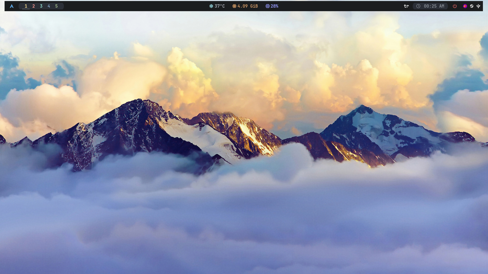

<div align="center">

# 🌿 bspwm-dotfiles

**bspwm**-based minimal and modern Arch Linux desktop setup.


</div>

---

## 📦 Contents

| Folder | Tool | Description |
|--------|------|-------------|
| `bspwm/` | [bspwm](https://github.com/baskerville/bspwm) | Window manager |
| `sxhkd/` | [sxhkd](https://github.com/baskerville/sxhkd) | Hotkey daemon |
| `polybar/` | [Polybar](https://github.com/polybar/polybar) | Status bar |
| `picom/` | [Picom](https://github.com/yshui/picom) | Compositor |
| `dunst/` | [Dunst](https://dunst-project.org) | Notification daemon |
| `kitty/` | [Kitty](https://sw.kovidgoyal.net/kitty/) | Terminal emulator |
| `rofi/` | [Rofi](https://github.com/davatorium/rofi) | Application launcher |
| `fish/` | [Fish](https://fishshell.com) | Shell |
| `nvim/` | [Neovim](https://neovim.io) | Text editor |

---

## ✨ Features

- 5 workspaces with colored icons on polybar
- Shadow and fade effects via **picom** compositor
- **Catppuccin**-themed rofi, kitty and neovim
- Turkish keyboard + Russian layout support (switch with `Alt+Shift`)
- Full-featured polybar with clock, temperature, CPU, RAM, volume, network and battery modules
- Wallpaper support via `feh`
- Automatic disk mounting via `udiskie`
- Icon-rich UI with `JetBrainsMono Nerd Font` + `Material Design Icons`
- Neovim with lazy.nvim, LSP, Telescope, Treesitter

---

## Image



---
## 🚀 Installation

### Requirements

- Arch Linux
- `git` and `python`

### One-liner Install

```bash
git clone https://github.com/lionesslie/bspwm-dotfiles
cd bspwm-dotfiles
python installer.py
```

`installer.py` automatically:

1. Installs all required packages via `pacman`
2. Backs up your existing configs with a `.bak` extension
3. Copies config files to `~/.config/`
4. Grants execute permissions (`+x`) to `bspwmrc` and `launch.sh`
5. Asks whether to set Fish as the default shell

---

## 📋 Installed Packages

```
bspwm  sxhkd  polybar  picom  dunst  kitty  rofi
thunar  feh  fish  udiskie  udisks2  neovim
ttf-jetbrains-mono-nerd  ttf-material-design-icons-extended
papirus-icon-theme  playerctl  brightnessctl
alsa-utils  xorg-xrandr  xorg-xinput  xorg-setxkbmap  xorg-xset
networkmanager  libnotify  xclip  flameshot  base-devel
```

---

## ⚙️ Post-Install

### Starting bspwm
```bash
# Add to ~/.xinitrc:
exec bspwm

# Then run:
startx
```

### Monitor setup
Update the monitor name in `~/.config/bspwm/bspwmrc` and `~/.config/polybar/config.ini`:
```bash
# List available monitors:
xrandr --listmonitors

# In bspwmrc:
xrandr --output HDMI-0 --mode 1920x1080 --rate 180 &

# In polybar/config.ini:
monitor = HDMI-0
```

### Wallpaper
```bash
# In ~/.config/bspwm/bspwmrc:
feh --bg-scale ~/Pictures/Wallpaper/1.jpg &
```

### ALSA audio
Check the sink number in the polybar `modules.ini` file:
```bash
# Find your sink number:
pactl list sinks short

# In modules.ini:
sink = 51   ← this may differ on your system
```

### Enable NetworkManager
```bash
sudo systemctl enable --now NetworkManager
```

### Keyboard layout
Turkish Q and Russian ЯВЕРТЫ layouts are included by default. To change them, edit `~/.config/sxhkd/sxhkdrc` or your desktop settings.

---

## ⌨️ Keybindings

| Keybinding | Action |
|------------|--------|
| `Super + Enter` | Terminal (kitty) |
| `Super + D` | Application launcher (rofi) |
| `Super + E` | File manager (thunar) |
| `Super + C` | Close window |
| `Super + M` | Toggle monocle layout |
| `Super + T` | Set tiled mode |
| `Super + S` | Set floating mode |
| `Super + F` | Fullscreen |
| `Super + Alt + Q` | Quit bspwm |
| `Super + Alt + R` | Restart bspwm |
| `Super + 1-9` | Switch workspace |
| `Super + Shift + 1-9` | Move window to workspace |
| `Super + H/J/K/L` | Focus window (vim directions) |
| `Super + Shift + H/J/K/L` | Move window |
| `Super + Alt + H/J/K/L` | Resize window |

---

## 📁 File Structure

```
bspwm-dotfiles/
├── bspwm/
│   └── bspwmrc
├── sxhkd/
│   └── sxhkdrc
├── polybar/
│   ├── config.ini
│   ├── colors.ini
│   ├── modules.ini
│   └── launch.sh
├── picom/
│   └── picom.conf
├── dunst/
│   └── dunstrc
├── kitty/
│   └── kitty.conf
├── rofi/
│   ├── config.rasi
│   └── catppuccin.rasi
├── fish/
│   ├── config.fish
│   └── fish_variables
├── nvim/
│   └── init.lua
├── README.md
└── installer.py
```
