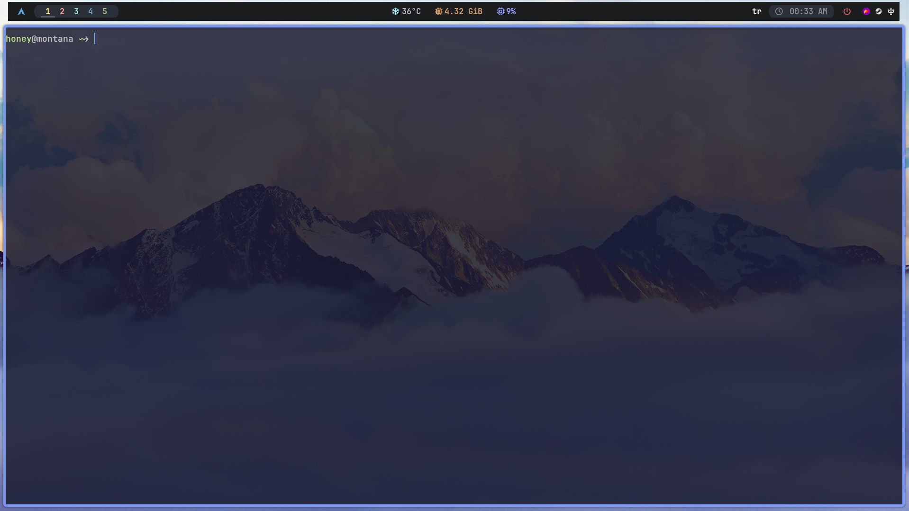
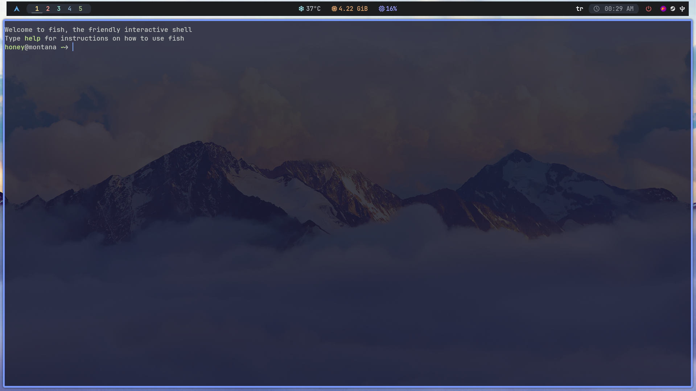

<div align="center">

# 🌿 bspwm-dotfiles

### Minimal & Modern bspwm Desktop Setup for Arch Linux and NixOS


</div>

<br>

## 📦 Contents

<div align="center">

| Folder | Tool | Description |
|:---:|:---:|:---|
| `bspwm/` | [bspwm](https://github.com/baskerville/bspwm) | Tiling window manager |
| `sxhkd/` | [sxhkd](https://github.com/baskerville/sxhkd) | Hotkey daemon |
| `polybar/` | [Polybar](https://github.com/polybar/polybar) | Status bar |
| `picom/` | [Picom](https://github.com/yshui/picom) | Compositor |
| `dunst/` | [Dunst](https://dunst-project.org) | Notification daemon |
| `alacritty/` | [Alacritty](https://alacritty.org) | Terminal emulator |
| `rofi/` | [Rofi](https://github.com/davatorium/rofi) | Application launcher |
| `fish/` | [Fish](https://fishshell.com) | Shell |
| `nvim/` | [Neovim](https://neovim.io) | Text editor |

</div>

<br>

## ✨ Features

- 🖥️ **5 workspaces** with colored icons on Polybar
- 🌫️ Shadow & fade effects powered by the **Picom** compositor
- 🎨 **Catppuccin** theme across Rofi, Kitty, and Neovim
- ⌨️ Turkish Q + Russian ЯВЕРТЫ keyboard layouts (toggle with `Alt + Shift`)
- 📊 Full-featured Polybar — clock, temperature, CPU, RAM, volume, network & battery
- 🖼️ Wallpaper management via `feh`
- 💾 Automatic disk mounting with `udiskie`
- 🔤 Icon-rich UI using `JetBrainsMono Nerd Font` + `Material Design Icons`
- ⚡ Neovim configured with `lazy.nvim`, LSP, Telescope & Treesitter

<br>

## 🚀 Installation

**Requirements:** Arch Linux · `git` · `python`

```bash
git clone https://github.com/lionesslie/bspwm-dotfiles
cd bspwm-dotfiles
python installer.py
```

The installer will automatically:

1. ✅ Install all required packages via `pacman`
2. 💾 Back up your existing configs with a `.bak` extension
3. 📁 Copy config files to `~/.config/`
4. 🔑 Grant execute permissions (`+x`) to `bspwmrc` and `launch.sh`
5. 🐟 Ask whether to set Fish as your default shell

<br>

## 🖼️ Preview

<div align="center">

**Desktop**
<br>


<br><br>

**Terminal**
<br>


</div>

<br>

## ⌨️ Keybindings

<div align="center">

| Keybinding | Action |
|:---|:---|
| `Super + Enter` | Open terminal (Kitty) |
| `Super + D` | Application launcher (Rofi) |
| `Super + E` | File manager (Thunar) |
| `Super + C` | Close window |
| `Super + M` | Toggle monocle layout |
| `Super + T` | Set tiled mode |
| `Super + S` | Set floating mode |
| `Super + F` | Fullscreen |
| `Super + Alt + Q` | Quit bspwm |
| `Super + Alt + R` | Restart bspwm |
| `Super + 1–9` | Switch workspace |
| `Super + Shift + 1–9` | Move window to workspace |
| `Super + H/J/K/L` | Focus window (vim directions) |
| `Super + Shift + H/J/K/L` | Move window |
| `Super + Alt + H/J/K/L` | Resize window |

</div>

<br>

## 📂 File Structure

```
bspwm-dotfiles/
├── alacritty/
│   └── alacritty.toml
├── bspwm/
│   ├── bspwmrc
│   └── xsettingsd
├── dunst/
│   └── dunstrc
├── fish/
│   ├── config.fish
│   └── fish_variables
├── gtk-3.0/
│   └── settings.ini
├── gtk-4.0/
│   └── settings.ini
├── nvim/
│   └── init.lua
├── picom/
│   ├── picom.conf
│   └── picom-animations.conf
├── polybar/
│   ├── colors.ini
│   ├── config.ini
│   ├── launch.sh
│   ├── modules.ini
│   └── powermenu.sh
├── rofi/
│   ├── catppuccin.rasi
│   └── config.rasi
├── sxhkd/
│   └── sxhkdrc
├── README.md
├── configuration.nix
├── copy-nix.sh
└── installer.py
```

<br>

<div align="center">

Made with 🌿 for the Linux ricing community

</div>
